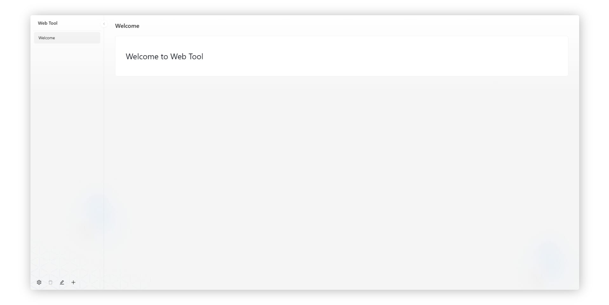

# Web Tool

基于 `gofiber` 和 `amis` , 快速构建 Web 工具应用

### 技术栈

- [fiber](https://github.com/gofiber/fiber)
- [amis](https://github.com/baidu/amis)
- [UmiJS](https://github.com/umijs/umi)
- [antd](https://github.com/ant-design/ant-design)

### 快速开始

1. `clone` 本项目
2. 安装依赖: `go mod tidy`
3. 启动服务: `go run main.go`

### 指南

- 使用场景
    - 做一些小工具 (初衷)
        - `go`: 高性能, 可跨平台编译
        - `amis`: 使用可视化编辑器, 快速处理 UI, 专注处理业务逻辑
    - 🤔 直接作为前端使用 (有一定的局限性, 但也是个不错的思路)
    
- 前端
    - 前端代码在 `/web` 目录下
    - 默认使用 `go:embed` 将页面打包到二进制文件中 (`/web/dist`)
    
- 启动参数
    - port: 端口号, 默认 3000
        - eg: `go run main.go -port=3000`
        - 如果端口被占用, 会自动尝试 端口号 + 1 (100次)
    - prod: 是否为生产环境, 默认 `false`
        - eg: `go run main.go -prod`
            - 为 `true` 时, 将关闭页面的编辑功能
        - 原理
            - 如果为 `true`, 将会创建 `./data/.prod` 文件
            - 如果为 `false`, 将会删除 `./data/.prod` 文件
            
- 数据存储
    - 程序启动时, 会检测 `./data/app.json` 文件是否存在, 如果不存在, 则会初始化存储目录
    - 所有数据均存储在 `./data` 目录下的 `json` 文件中
        - `./data/app.json`: 存储配置信息及菜单信息
        - `./data/pages/*.json`: 存储页面数据 (每个页面一个文件)
